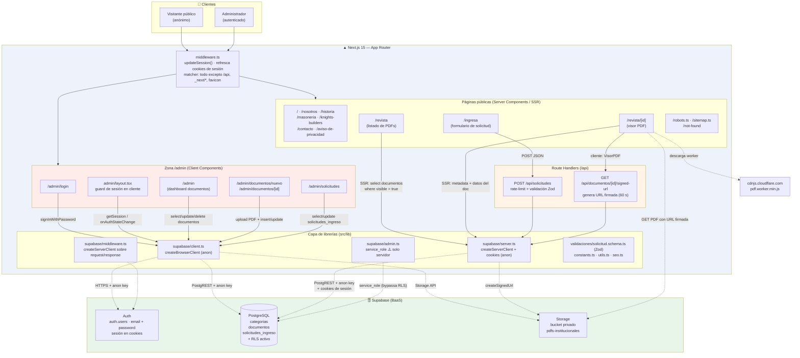
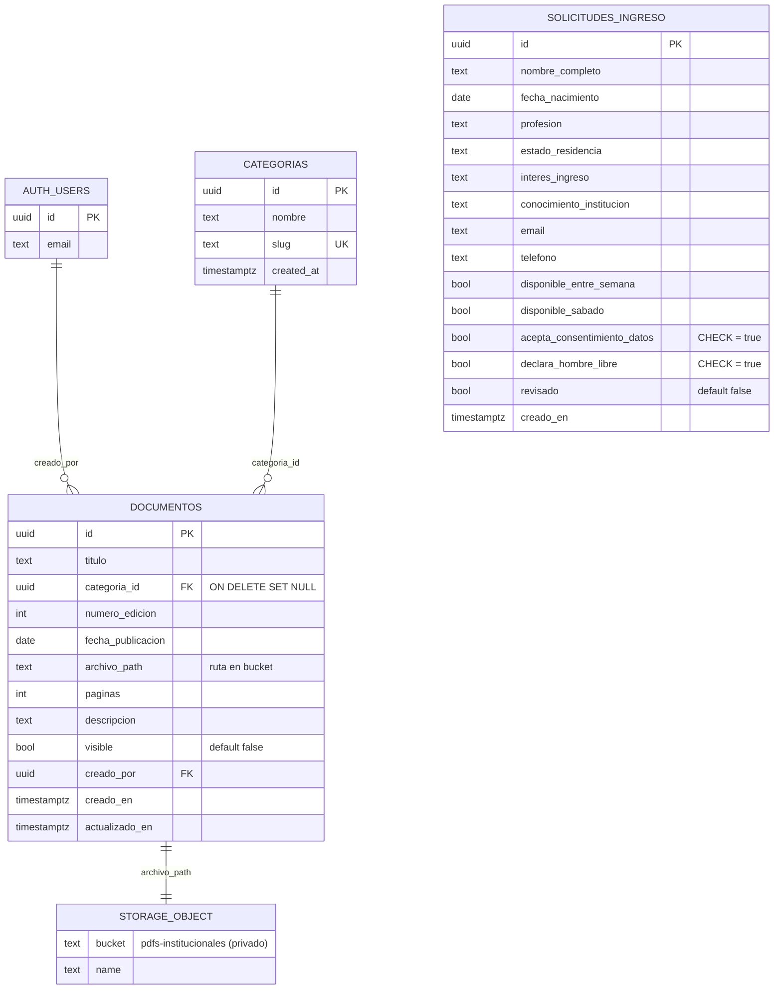
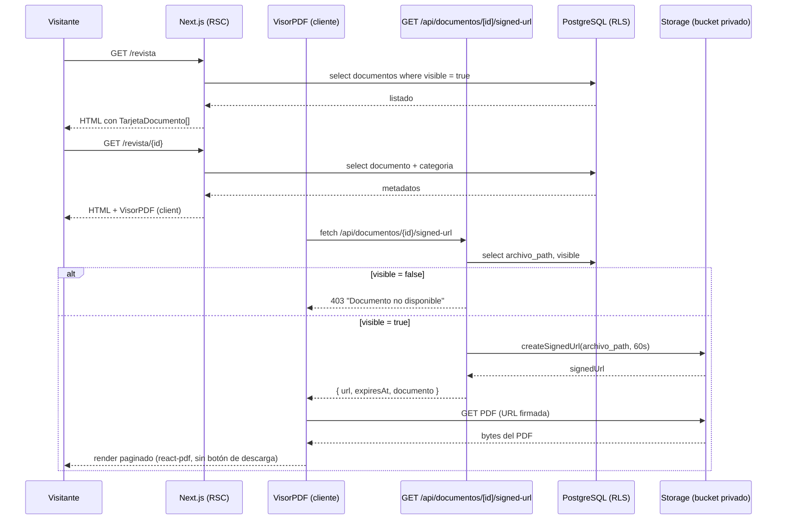
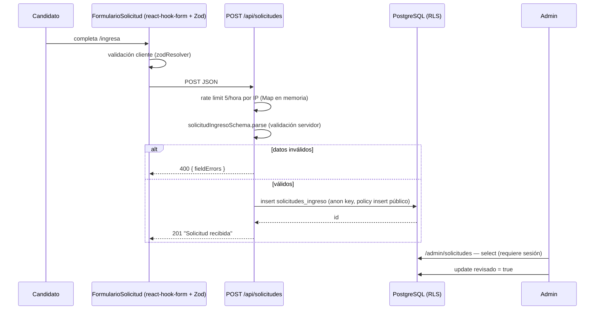
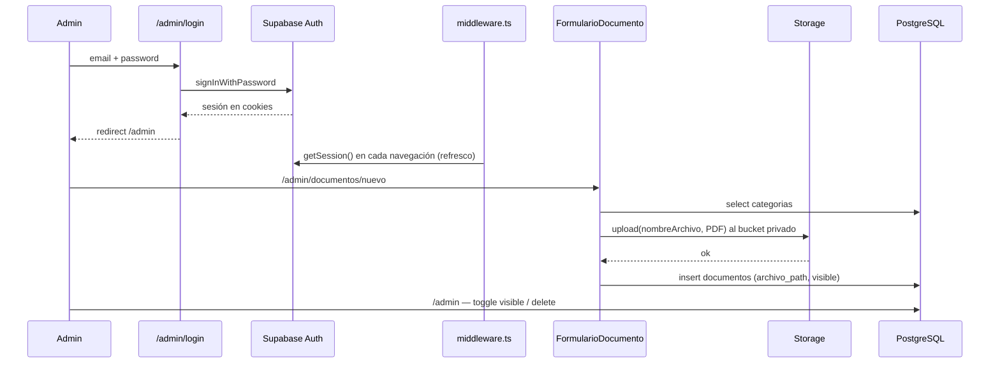

# Diagrama general del sitio — MRGLVM

Documento de arquitectura del proyecto `mrglvm-web`: componentes técnicos, páginas funcionales y conexión a base de datos.

Stack: **Next.js 15 (App Router) + React 18 + TypeScript + Tailwind CSS + Supabase (PostgreSQL, Auth, Storage) + react-pdf/pdfjs-dist + Zod + react-hook-form**.

---

## 1. Diagrama general de arquitectura



---

## 2. Mapa de páginas funcionales

| Ruta | Tipo | Función | Origen de datos |
|---|---|---|---|
| `/` | Server Component | Home institucional (Hero, secciones, CTA) | Estático |
| `/nosotros` | Server Component | Quiénes somos, `LineaDeTiempo` | Estático |
| `/historia` | Server Component | Historia de la masonería | Estático |
| `/masoneria` | Server Component | Divulgación / preguntas frecuentes | Estático |
| `/knights-builders` | Server Component | Knights Builders Grand Chapter | Estático |
| `/revista` | Server Component (SSR) | Hemeroteca: lista documentos publicados | `documentos` (visible = true) |
| `/revista/[id]` | Server Component + `VisorPDF` (cliente) | Lectura paginada del PDF, sin descarga | `documentos` + Storage vía URL firmada |
| `/ingresa` | Client Component | Formulario de solicitud de ingreso | `POST /api/solicitudes` |
| `/contacto` | Server Component | Datos de contacto y formulario **estático** (sin `action`/`onSubmit`) | — |
| `/aviso-de-privacidad` | Server Component | Aviso legal (LFPDPPP) | Estático |
| `/robots.ts`, `/sitemap.ts` | Route Handlers | SEO | Estático |
| `/not-found` | Server Component | 404 | — |
| `/admin/login` | Client Component | Login con email + contraseña | Supabase Auth |
| `/admin` | Client Component | Dashboard: listar documentos, alternar visibilidad, eliminar | `documentos` + `categorias` |
| `/admin/documentos/nuevo` | Client Component | Alta: sube PDF a Storage + inserta registro | Storage + `documentos` |
| `/admin/documentos/[id]` | Client Component | Edición de metadatos / reemplazo de archivo | Storage + `documentos` |
| `/admin/solicitudes` | Client Component | Bandeja de solicitudes, filtro y marcar revisadas | `solicitudes_ingreso` |

`next.config.js` mantiene **7 redirects 301** desde las URLs del sitio anterior (`/revistas-institucionales` → `/revista`, `/descubrelamasoneria` → `/masoneria`, etc.).

---

## 3. Modelo de datos y conexión a base de datos



### Rutas de conexión a Supabase

| Cliente | Archivo | Clave | Contexto | Uso |
|---|---|---|---|---|
| Browser | `src/lib/supabase/client.ts` | `NEXT_PUBLIC_SUPABASE_ANON_KEY` | Navegador | Login, panel admin, upload de PDFs |
| Server | `src/lib/supabase/server.ts` | anon key + cookies | RSC y Route Handlers | SSR de `/revista`, `/revista/[id]`, ambas APIs |
| Middleware | `src/lib/supabase/middleware.ts` | anon key sobre request/response | Edge/middleware | Refresco de sesión en cada navegación |
| Admin | `src/lib/supabase/admin.ts` | `SUPABASE_SERVICE_ROLE_KEY` | Solo servidor | Operaciones que bypassan RLS |

Todas las lecturas/escrituras pasan por **PostgREST** de Supabase con RLS aplicado en la base; no hay ORM ni servidor propio de base de datos.

### Políticas RLS vigentes

| Tabla | anon | authenticated |
|---|---|---|
| `documentos` | `SELECT` solo `visible = true` | `SELECT` todo (incl. borradores), `INSERT`, `UPDATE`, `DELETE` |
| `solicitudes_ingreso` | `INSERT` únicamente | `SELECT`, `UPDATE`, `DELETE` |
| `storage.objects` (`pdfs-institucionales`) | sin acceso directo | `SELECT`, `INSERT`, `UPDATE`, `DELETE` |
| `categorias` | RLS no habilitado (lectura abierta) | — |

El bucket es **privado**: el público nunca accede a los PDFs directamente, solo mediante URLs firmadas de 60 segundos (`PDF_SIGNED_URL_EXPIRY_SECONDS`).

---

## 4. Flujo A — Lectura de un documento PDF



## 5. Flujo B — Solicitud de ingreso



## 6. Flujo C — Publicación de un documento (admin)



---

## 7. Componentes de interfaz

```
src/components/
├── layout/           Header, Footer            → usados en app/layout.tsx
├── ui/               Button, Card, Input, Textarea, Checkbox
├── Hero, SeccionImagenTexto, GaleriaImagenes, LineaDeTiempo
├── revista/          ListaDocumentosPDF (RSC) → TarjetaDocumento
│                     VisorPDF (client, react-pdf + worker de CDN)
├── admin/            FormularioDocumento (client, upload + CRUD)
└── FormularioSolicitud/  FormularioSolicitud (client, RHF + Zod)
```

---

## 8. Observaciones sobre el estado actual

Puntos que el diagrama deja a la vista y conviene tener presentes:

1. **`FormularioDocumento.tsx` (`'use client'`) importa `createAdminClient`** (`src/lib/supabase/admin.ts:8`), que lee `SUPABASE_SERVICE_ROLE_KEY`. El import está sin usar y la variable no es `NEXT_PUBLIC_`, así que hoy no se filtra la clave, pero es un import que debe eliminarse para que nunca llegue al bundle del navegador.
2. **El guard de `/admin` es solo de cliente** (`admin/layout.tsx`): el middleware refresca la sesión pero no redirige. La protección real la da RLS, no el enrutado.
3. **RLS de admin es "cualquier usuario autenticado"**: no hay tabla de roles ni claim de admin. Cualquier usuario dado de alta en `auth.users` puede ver borradores y las solicitudes de ingreso (datos personales).
4. **El formulario de `/contacto` no envía nada**: es markup sin `action` ni handler.
5. **El rate limit de `/api/solicitudes` vive en un `Map` en memoria**: se reinicia en cada cold start y no se comparte entre instancias serverless.
6. **El worker de PDF.js se carga desde cdnjs**: dependencia externa en tiempo de render y riesgo de desajuste de versión con `pdfjs-dist`.
